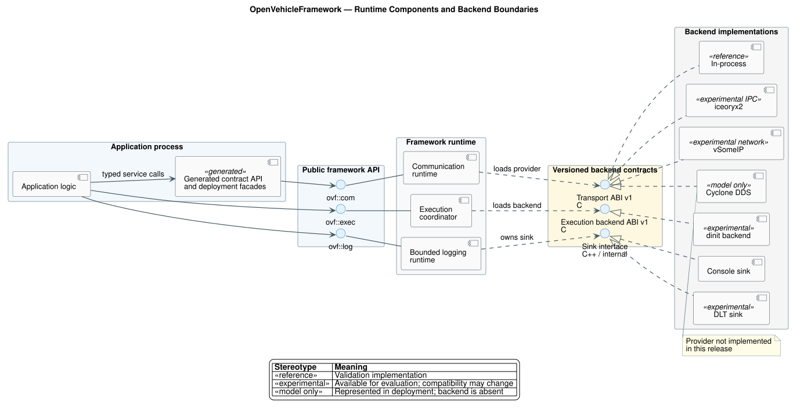
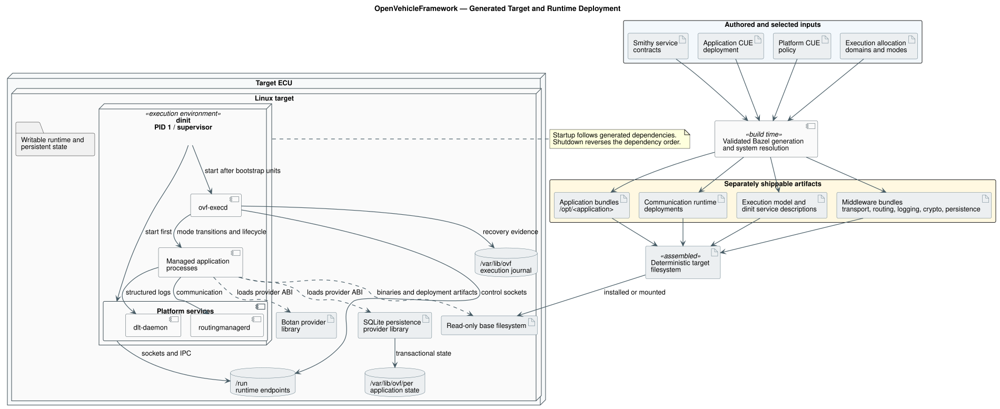

# OpenVehicleFramework

OpenVehicleFramework is an experimental, early-stage vehicle application
framework. It is a development and evaluation project for transport-neutral
communication, application execution, deployment generation, and structured
logging. It is not a finished vehicle software platform.

> [!WARNING]
> Version 0.0.3 is experimental. It is not production-ready, safety-qualified,
> or intended for use in a vehicle. APIs, generated artifacts, deployment
> formats, and binary interfaces may change without compatibility guarantees.

## Current scope

The repository currently contains:

- an explicit communication runtime with static and dynamic transport
  registration;
- a versioned C transport boundary usable by C++ and Rust implementations;
- Smithy-based service definitions and template-driven Rust C++ generation;
- deployment schema validation and deterministic application packaging;
- validated execution domains, modes, unit dependencies, and lifecycle policy;
- dinit-backed process supervision through the `ovf-execd` coordinator;
- bounded structured logging with typed fields, stable event identifiers,
  filtering, loss accounting, and a DLT binding;
- a versioned cryptographic provider ABI with opaque policy-bound keys,
  certificate validation, key agreement, bounded streaming and asynchronous
  operations, and a checksum-pinned Botan software provider;
- transactional persistent key/value and streaming large-object APIs with a
  versioned provider ABI, generated deployment facades, and SQLite and
  in-memory providers;
- deterministic target-filesystem assembly with executable integrity binding;
- an in-process reference transport;
- experimental iceoryx2 and vSomeIP transport integrations;
- transport conformance, interoperability, lifecycle recovery, and Linux
  end-to-end tests.

DDS is represented in the deployment model, but a DDS transport implementation
is not included in this release.

## Architecture

[](docs/diagrams/runtime-components.puml)

Backend status is intentionally explicit:

| Cluster | Backend | Boundary | Status |
|---|---|---|---|
| Communication | in-process | versioned C transport ABI | Reference implementation |
| Communication | iceoryx2 | versioned C transport ABI | Experimental IPC integration |
| Communication | vSomeIP | versioned C transport ABI | Experimental SOME/IP integration |
| Communication | Cyclone DDS | versioned C transport ABI | Deployment model only; provider not implemented |
| Execution | dinit | versioned C execution-backend ABI | Experimental Linux integration |
| Logging | console | internal C++ sink interface | Implemented |
| Logging | DLT | internal C++ sink interface | Experimental Linux integration |
| Cryptography | Botan | versioned C cryptographic-provider ABI | Experimental software provider |
| Persistence | SQLite | versioned C persistence-provider ABI | Experimental durable provider |
| Persistence | in-memory | versioned C persistence-provider ABI | Reference implementation |

The logging sink interface is not currently a stable binary plugin contract.
The communication transport, execution backend, cryptographic provider, and
persistence provider ABIs are versioned C boundaries in this release.

The cryptographic API keeps provider-owned key material behind opaque handles
and enforces algorithm and usage policy at the provider boundary. It supports
random generation, hashing, authentication, authenticated encryption,
signatures, key derivation and agreement, certificate-path validation, bounded
input and record streaming, and bounded asynchronous hash/sign/verify work.
Cancellation, deadlines, and runtime shutdown have explicit outcomes. The
Botan binding is an experimental software provider; this release does not
claim hardware-backed keys, durable key storage, or a complete credential
provisioning lifecycle.

Service contracts are separate from deployment configuration. Applications use
generated types, generated deployment facades, and `ovf::com` APIs. Deployment
selects runtime-loaded provider plugins and generates their configuration.

Application targets also export their executable identity and relative install
path. System integration composes those targets with execution allocation and
platform policy, generates dinit service descriptions, and packages a complete
target filesystem. `ovf-execd` exposes system-wide execution domains and modes
without embedding communication-specific behavior.

Logging intent is defined alongside each application's deployment. The
`ovf_log_application` Bazel rule validates that intent and generates the
runtime factory and backend identifier mapping. Application source uses only
`ovf::log`; backend identifiers and initialization remain outside application
source.

Persistence intent is defined in application CUE deployment, while physical
storage roots, journal policy, and provider choice remain platform-owned. The
`ovf_per_application` Bazel rule validates the composed model and generates
named store factories, bounded initial data, and explicit reset operations.
Smithy record schemas generate stable identifiers and deterministic,
endian-independent codecs. Applications use only `ovf::per` typed records,
transactions, ordered snapshot cursors, and blob streams. The SQLite provider
enforces deployment compatibility, shared quotas, cross-process writer
exclusion, generation conflicts, explicit durability, structured recovery
status, and resumable offline migration with explicit rollback. Its runtime,
provider, license notice, and storage root are assembled independently into the
Linux target filesystem and exercised through the installed provider path.
These mechanisms do not constitute storage-hardware or power-loss
qualification.

### Build and deployment flow

Contracts, application intent, provider policy, and machine allocation remain
separate inputs. System integration resolves them into independently shippable
application and middleware artifacts before assembling a target filesystem.

[](docs/diagrams/target-deployment.puml)

Application bundles contain application code and generated application
artifacts. Middleware binaries and platform configuration are packaged
separately and are combined only by target integration. On boot, dinit starts
the declared platform services; `ovf-execd` then coordinates execution domains,
modes, dependency ordering, readiness, recovery, and reverse shutdown.

See the [communication architecture](docs/com-architecture.md) for the public
design principles and provider model.

## Building

The primary build uses Bazel 8.2.1. Bazel downloads the declared build
dependencies and toolchains; a host installation of the project dependencies
is not required.

```sh
bazel test //:all_tests
bazel test --config=strict //:all_tests
bazel run //quality:check
```

Build the example application and its deterministic target bundle with:

```sh
bazel build //examples/radar:radar_inproc_client
bazel build //examples/radar:radar_inproc_client_bundle
```

On Linux, build the composed execution target filesystem with:

```sh
bazel build //examples/execution:target_filesystem
```

On Linux, run the generated service/client vSomeIP example as two processes:

```sh
bazel test //tests/integration/vsomeip:radar_two_process_test
```

See the [radar vSomeIP example](examples/radar/README.md) for the
interactive service and client commands.

The [repository quality gate](quality/README.md) checks source formatting,
Starlark build files, SPDX headers, syntax, repository hygiene, and strict
compiler warnings using Bazel-managed tools.

For native or QEMU-emulated Linux validation, the
[Linux development lab](lab/README.md) provides a mountable multi-architecture
image with persistent build cache, structured logs, optional key-only SSH,
network diagnostics, and exportable root filesystems. Its execution pipeline
boots the packaged target through dinit from a real kernel OverlayFS mount and
verifies application startup, service discovery, data exchange, mode
transitions, reverse shutdown, and journal persistence.

## Building an application

The public `ovf_cc_application` Bazel macro accepts application sources,
headers, Smithy service IDL, and typed CUE deployment intent:

```starlark
load("@openvehicleframework//bazel:application.bzl", "ovf_cc_application")

ovf_cc_application(
    name = "radar_app",
    srcs = ["main.cpp"],
    hdrs = ["radar_logic.hpp"],
    interfaces = ["//contracts/radar"],
    deployment = "radar.deployment.cue",
)
```

It compiles the contract and application intent into portable generated code,
an application model, and a target bundle. Provider selection belongs to system
integration, where independent bindings such as
`//com/deployment/bindings:iceoryx2.cue` and
`//com/deployment/bindings:vsomeip.cue` are composed into per-application
runtime deployments. Target platform selection remains a separate Linux, QNX,
architecture, and toolchain concern.
Middleware binaries are delivered separately from application bundles.

See [Building applications with Bazel](docs/building-applications.md) for the
generated targets and shipping boundary.

The example applications include a camera provider, radar and camera consumers
in one sensor-fusion process, and a fused environment-model stream delivered
over SOME/IP to `driving_policy`.

## Repository layout

```text
bazel/          public build rules, toolchains, and build tests
codegen/        Rust generator and versioned MiniJinja templates
com/            runtime, public API, deployments, transports, and tests
contracts/      authored service contracts
docs/           public architecture and application documentation
examples/       example applications
exec/           execution model, coordinator, dinit backend, and tests
log/            structured logging API, runtime, bindings, deployments, tests
crypto/         cryptographic API, provider ABI, Botan binding, and tests
per/            persistence API, provider ABI, deployments, providers, tests
integration/    independent consumer build fixture
lab/            Linux validation image, rootfs export, and debug entry point
platform/       target provider selection and platform deployment policy
quality/        formatting, licensing, and repository hygiene gate
tools/          model compilation, validation, and packaging tools
```

## Versioning

The project uses semantic versioning. During the `0.x` series, source, binary,
model, deployment, and generated-code compatibility are not guaranteed between
releases. Compatibility commitments will be defined before a stable 1.0
release.

## Third-party dependencies

Key build and runtime dependencies are retrieved under their own licenses:

| Dependency | Purpose | License |
|---|---|---|
| [vSomeIP](https://github.com/COVESA/vsomeip) | SOME/IP transport | [MPL-2.0](https://www.mozilla.org/MPL/2.0/) |
| [iceoryx2](https://github.com/eclipse-iceoryx/iceoryx2) | shared-memory transport | Apache-2.0 OR MIT |
| [Boost](https://www.boost.org/) | vSomeIP dependency | [Boost Software License 1.0](https://www.boost.org/LICENSE_1_0.txt) |
| [Botan](https://botan.randombit.net/) | software cryptographic provider | [Simplified BSD](https://botan.randombit.net/license.html) |
| [SQLite](https://sqlite.org/) | durable persistence provider | [Public domain](https://sqlite.org/copyright.html) |
| [Buildifier](https://github.com/bazelbuild/buildtools) | Starlark formatting and linting | Apache-2.0 |
| [CUE](https://cuelang.org/) | Deployment definition and validation | Apache-2.0 |
| [DLT daemon](https://github.com/COVESA/dlt-daemon) | Diagnostic log binding and daemon | [MPL-2.0](https://www.mozilla.org/MPL/2.0/) |
| [dinit](https://github.com/davmac314/dinit) | Process supervision and generated execution backend | [Apache-2.0](https://www.apache.org/licenses/LICENSE-2.0) |

These dependencies are not relicensed under the project's Apache-2.0 license.
Future binary distributions must include the license and notice material
required by the exact dependency versions they contain.

## License

OpenVehicleFramework is licensed under the
[Apache License 2.0](LICENSE).
